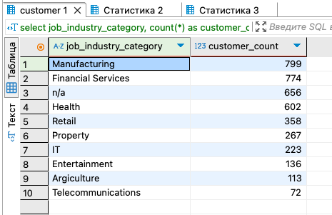
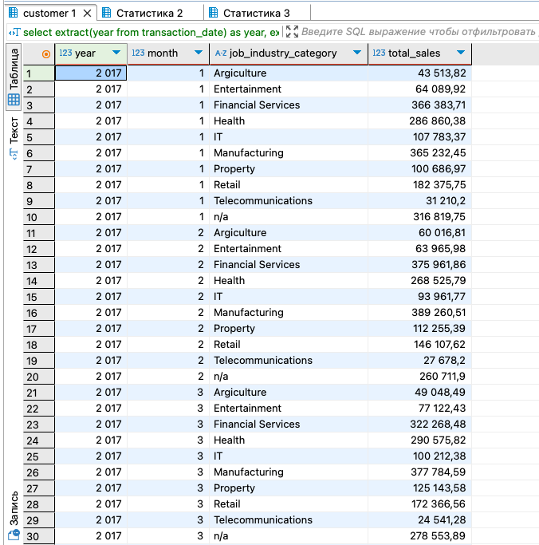
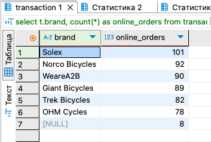
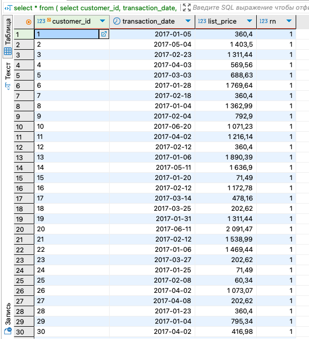
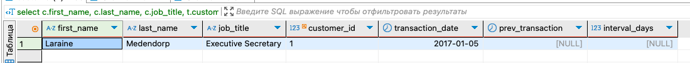

# Data_storage-processing_HW3

## Задание
Дано два csv-файла с данными о клиентах (customer.csv) и их транзакциях (transaction.csv). Необходимо выполнить следующие пункты:
1. Создать таблицы со следующими структурами и загрузить данные из csv-файлов (описание приведено ниже);
2. Выполнить следующие запросы:
- Вывести распределение (количество) клиентов по сферам деятельности, отсортировав результат по убыванию количества.
- Найти сумму транзакций за каждый месяц по сферам деятельности, отсортировав по месяцам и по сфере деятельности. 
- Вывести количество онлайн-заказов для всех брендов в рамках подтвержденных заказов клиентов из сферы IT.
- Найти по всем клиентам сумму всех транзакций (list_price), максимум, минимум и количество транзакций, отсортировав результат по убыванию суммы транзакций и количества клиентов. Выполните двумя способами: используя только group by и используя только оконные функции. Сравните результат.
- Найти имена и фамилии клиентов с минимальной/максимальной суммой транзакций за весь период (сумма транзакций не может быть null). Напишите отдельные запросы для минимальной и максимальной суммы.
- Вывести только самые первые транзакции клиентов. Решить с помощью оконных функций.
- Вывести имена, фамилии и профессии клиентов, между транзакциями которых был максимальный интервал (интервал вычисляется в днях).

## 1. Создать таблицы со следующими структурами и загрузить данные из csv-файлов
### Запросы (создать таблицы и связать, загрузить в них данные из csv, проверить):
```dbml
create table customer (
    customer_id serial primary key,
    first_name varchar(50),
    last_name varchar(50),
    gender varchar(10),
    "DOB" date,
    job_title varchar(50),
    job_industry_category varchar(50),
    wealth_segment varchar(50),
    deceased_indicator boolean,
    owns_car boolean,
    address varchar(50),
    postcode varchar(10),
    state varchar(50),
    country varchar(50),
    property_valuation int
);

select * from information_schema.tables where table_name = 'customer';

create table transaction (
    transaction_id serial primary key,
    product_id int,
    customer_id int references customer(customer_id),
    transaction_date date,
    online_order boolean,
    order_status varchar(30),
    brand varchar(30),
    product_line varchar(30),
    product_class varchar(30),
    product_size varchar(30),
    list_price decimal(10,2),
    standard_cost decimal(10,2)
);

select conname, conrelid::regclass, confrelid::regclass
from pg_constraint
where confrelid = 'customer'::regclass;

copy customer from '/Users/ekaterina.dorokhova/Desktop/ХОД/ДЗ 3/customer.csv' 
with (format csv, header true, delimiter ';');

set datestyle = 'ISO, DMY';

copy transaction from '/Users/ekaterina.dorokhova/Desktop/ХОД/ДЗ 3/transaction3.csv' 
with (format csv, header true, delimiter ',');

select column_name, data_type, character_maximum_length
from information_schema.columns
where table_name = 'customer';

select column_name, data_type, character_maximum_length
from information_schema.columns
where table_name = 'transaction';
```

## 2. Выполнить запросы
### 1) :
```dbml

```
### Скриншот результата


### 2) :
```dbml

```
### Скриншот результата

  
### 3) :
```dbml

```
### Скриншот результата


 ### 4) :
```dbml

```
### Скриншот результата


 ### 5) :
```dbml

```
### Скриншот результата


 ### 6) :
```dbml

```
### Скриншот результата


 ### 7) :
```dbml

```
### Скриншот результата

