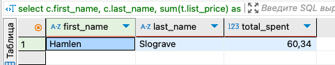
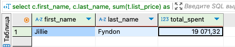

# Data_storage-processing_HW3

## Задание
Дано два csv-файла с данными о клиентах (customer.csv) и их транзакциях (transaction.csv). Необходимо выполнить следующие пункты:
1. Создать таблицы со следующими структурами и загрузить данные из csv-файлов (описание приведено ниже);
2. Выполнить следующие запросы:
- Вывести распределение (количество) клиентов по сферам деятельности, отсортировав результат по убыванию количества.
- Найти сумму транзакций за каждый месяц по сферам деятельности, отсортировав по месяцам и по сфере деятельности. 
- Вывести количество онлайн-заказов для всех брендов в рамках подтвержденных заказов клиентов из сферы IT.
- Найти по всем клиентам сумму всех транзакций (list_price), максимум, минимум и количество транзакций, отсортировав результат по убыванию суммы транзакций и количества клиентов. Выполните двумя способами: используя только group by и используя только оконные функции. Сравните результат.
- Найти имена и фамилии клиентов с минимальной/максимальной суммой транзакций за весь период (сумма транзакций не может быть null). Напишите отдельные запросы для минимальной и максимальной суммы.
- Вывести только самые первые транзакции клиентов. Решить с помощью оконных функций.
- Вывести имена, фамилии и профессии клиентов, между транзакциями которых был максимальный интервал (интервал вычисляется в днях).

## 1. Создать таблицы со следующими структурами и загрузить данные из csv-файлов
### Запросы (создать таблицы и связать, загрузить в них данные из csv, проверить):
```dbml
create table customer (
    customer_id serial primary key,
    first_name varchar(50),
    last_name varchar(50),
    gender varchar(10),
    "DOB" date,
    job_title varchar(50),
    job_industry_category varchar(50),
    wealth_segment varchar(50),
    deceased_indicator boolean,
    owns_car boolean,
    address varchar(50),
    postcode varchar(10),
    state varchar(50),
    country varchar(50),
    property_valuation int
);

select * from information_schema.tables where table_name = 'customer';

create table transaction (
    transaction_id serial primary key,
    product_id int,
    customer_id int references customer(customer_id),
    transaction_date date,
    online_order boolean,
    order_status varchar(30),
    brand varchar(30),
    product_line varchar(30),
    product_class varchar(30),
    product_size varchar(30),
    list_price decimal(10,2),
    standard_cost decimal(10,2)
);

select conname, conrelid::regclass, confrelid::regclass
from pg_constraint
where confrelid = 'customer'::regclass;

copy customer from '/Users/ekaterina.dorokhova/Desktop/ХОД/ДЗ 3/customer.csv' 
with (format csv, header true, delimiter ';');

set datestyle = 'ISO, DMY';

copy transaction from '/Users/ekaterina.dorokhova/Desktop/ХОД/ДЗ 3/transaction3.csv' 
with (format csv, header true, delimiter ',');

select column_name, data_type, character_maximum_length
from information_schema.columns
where table_name = 'customer';

select column_name, data_type, character_maximum_length
from information_schema.columns
where table_name = 'transaction';
```
Скриншоты результата
  


## 2. Выполнить запросы
### 1) Вывести распределение (количество) клиентов по сферам деятельности, отсортировав результат по убыванию количества:
```dbml
select job_industry_category, count(*) as customer_count
from customer
group by job_industry_category
order by customer_count desc;
```
Скриншот результата
  


### 2) Найти сумму транзакций за каждый месяц по сферам деятельности, отсортировав по месяцам и по сфере деятельности:
```dbml
select extract(year from transaction_date) as year,
       extract(month from transaction_date) as month,
       c.job_industry_category,
       sum(t.list_price) as total_sales
from transaction t
join customer c on t.customer_id = c.customer_id
group by year, month, c.job_industry_category
order by year, month, c.job_industry_category;
```
Скриншот результата
  

  
### 3) Вывести количество онлайн-заказов для всех брендов в рамках подтвержденных заказов клиентов из сферы IT:
```dbml
select t.brand, count(*) as online_orders
from transaction t
join customer c on t.customer_id = c.customer_id
where t.online_order = true
  and t.order_status = 'Approved'
  and c.job_industry_category = 'IT'
group by t.brand
order by online_orders desc;
```
Скриншот результата
  


 ### 4) Найти по всем клиентам сумму всех транзакций (list_price), максимум, минимум и количество транзакций, отсортировав результат по убыванию суммы транзакций и количества клиентов. Выполните двумя способами: используя только group by и используя только оконные функции. Сравните результат:
Способ 1: group by
```dbml
select customer_id, 
       sum(list_price) as total_spent,
       max(list_price) as max_transaction,
       min(list_price) as min_transaction,
       count(*) as transaction_count
from transaction
group by customer_id
order by total_spent desc, transaction_count desc;
```
Способ 2: Оконные функции
```dbml
select customer_id, 
       sum(list_price) as total_spent,
       max(list_price) as max_transaction,
       min(list_price) as min_transaction,
       count(*) as transaction_count
from transaction
group by customer_id
order by total_spent desc, transaction_count desc;
```
Сравнение:
1) Оба способа позволяют получить общую сумму (total_spent), максимальную (max_transaction) и минимальную (min_transaction) сумму транзакций и количество транзакций (transaction_count) для каждого клиента.
Их результаты совпадают.
2) Разница: group by группирует данные и выдаёт по одной строке на группу (например, на клиента) - не даёт доступ к деталям отдельных транзакций. Оконные функции не группируют данные, а добавляют значения к каждой строке - так в результате запроса мы видим больше информации, но одновременно с этим дублированием строк может оказаться сложнее анализировать. Чтобы убрать дубли, можем использовать оператор distinct - тогда получаем результат такой же, как с group by. При этом, т.к. данные в строках не были объединены, то всё ещё остаётся возможность получить детализированнцю информацию по отделньым строкам при необходимости (например, в последующих запросах, при использовании других функции.
   
Скриншоты результатов
  


Результат способа 2 без distinct
  


 ### 5) Найти имена и фамилии клиентов с минимальной/максимальной суммой транзакций за весь период (сумма транзакций не может быть null). Напишите отдельные запросы для минимальной и максимальной суммы:
Минимальная сумма
```dbml
select c.first_name, c.last_name, sum(t.list_price) as total_spent
from transaction t
join customer c on t.customer_id = c.customer_id
group by c.customer_id, c.first_name, c.last_name
having sum(t.list_price) = (select min(total) 
                            from (select customer_id, sum(list_price) as total
                                  from transaction
                                  group by customer_id) sub);
```
Максимальная сумма
```dbml
select c.first_name, c.last_name, sum(t.list_price) as total_spent
from transaction t
join customer c on t.customer_id = c.customer_id
group by c.customer_id, c.first_name, c.last_name
having sum(t.list_price) = (select max(total) 
                            from (select customer_id, sum(list_price) as total
                                  from transaction
                                  group by customer_id) sub);
```
Скриншоты результатов
  



 ### 6) Вывести только самые первые транзакции клиентов. Решить с помощью оконных функций:
```dbml
select * from (
    select customer_id, transaction_date, list_price, 
           row_number() over (partition by customer_id order by transaction_date) as rn
    from transaction
) t
where rn = 1;
```
Скриншот результата
  


 ### 7) Вывести имена, фамилии и профессии клиентов, между транзакциями которых был максимальный интервал (интервал вычисляется в днях):
```dbml
select c.first_name, c.last_name, c.job_title, 
       t.customer_id, t.transaction_date, 
       lag(t.transaction_date) over (partition by t.customer_id order by t.transaction_date) as prev_transaction,
       t.transaction_date - lag(t.transaction_date) over (partition by t.customer_id order by t.transaction_date) as interval_days
from transaction t
join customer c on t.customer_id = c.customer_id
order by interval_days desc
limit 1;
```
Скриншот результата
  

